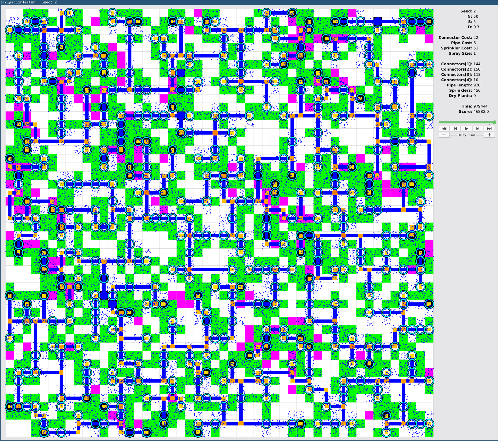

## Strategy
I create an initial solution that sprinkles every plant and then keep repeating the following steps until I run out of time:
* remove some random sprinklers, check if it improves the solution
* connect the now dry plants to new sprinklers
* make sure the new sprinklers are connected to a water supply
* randomly move sprinklers along existing pipes, undo if the score gets worse
* keep the changes of this iteration, if the score does not get worse, otherwise roll back to previous state
When stuck for too long, I make an exception and allow to get worse while resetting the stuck timer.

For removal of sprinklers I start with a random one and then remove others nearby. I remove a random amount of 1..4 (large maps) up to 1..9 (small maps) at a time.

In order to connect the missing plants again, I loop over them in random order and pick a possible sprinkler location at random (with higher probability for a cell close to water or a cell already connected). Then I try to remove some more sprinklers that may have gotten redundant thanks to the new placements. Finally I find a path to place pipes and connect the new sprinklers.

The removal and following connection phase can rip the graph apart, leaving some sprinklers connected to each other but not to the water. This will be corrected in some cleanup.

All those functions compute a score change to update the previous score rather than recompute everything all the time.

## Static analysis
For some seeds (seed 2 as a prime example), we can have a close look and say that there must be a sprinkler placed on some cell, while others can't have a sprinkler.
When a plant can only be reached via a single cell, that cell needs a sprinkler (only applicable on larger maps, where the penalty of killing a plant gets too high). However this sprinkler might also cover other cells, making further sprinklers for those plants useless.
Articulation points on the path between water and a strongly connected component are also worth checking, as some cells within the component might only be able to reach the same plants or a subset of what the articuation point can do. In that case the articulation point would be the better place for a sprinkler, as it requires less pipes to reach.

Here you can see, how I ruled out some sprinkler locations (magenta) and enforced others (black background for sprinklers), reducing the search space:


## Scores
As achieved on TC servers by my last submit
```
Test Case  #1: Score =   751
Test Case  #2: Score = 48138
Test Case  #3: Score =  6495
Test Case  #4: Score =  8095
Test Case  #5: Score =  2980
Test Case  #6: Score =  6870
Test Case  #7: Score = 10267
Test Case  #8: Score =  1155
Test Case  #9: Score = 11730
Test Case #10: Score = 37536
```